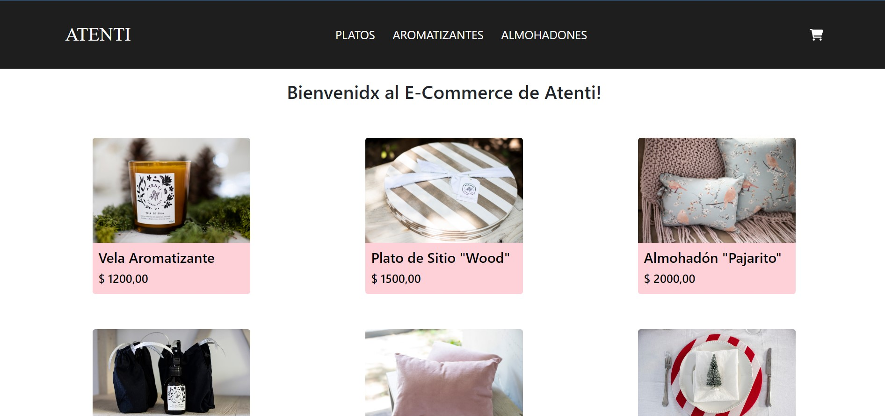

# E-commerce productos de decoración "Atenti Tienda Deco"



## Descripción del proyecto.

Tienda online de productos de decoración tales como almohadones, aromatizantes, etc.

En este e-commerce vas a poder elegir los productos de tu preferencia, en la cantidad que lo desees siempre y cuando estén en stock. Al finalizar la compra tendrás los detalles de los productos seleccionados y un ID de compra único luego de brindar tus datos personales para poder aceptar la compra.

## Librerías utilizadas:
- Firebase
  - Almacena los datos de los productos, las categorías y las compras.
- React-router-dom
  - Permite enlazar las rutas del proyecto y generar la navegabilidad en el mismo.
- Bootstrap
  - Esta librería fue utilizada para crear la barra de navegación y sus diseños.
- Font-awesome-icon
  - El ícono del Cart le pertenece a esta librería.
- React-spinners
  - Provee diseños para mejorar la experiencia de usuario a la hora de cargar los componentes y las distintas pestañas del sitio.

## Funcionalidad del proyecto.
### El usuario podrá:
- Disponer de una lista completa de los productos y 3 pestañas distintas en dónde se dividen por categorías.
- Agregar 1 producto o más al carrito y desde el mismo eliminar el producto con la cantidad elegida o eliminar todo del carrito.
- Brindar sus datos al finalizar la compra para así poder generar un ID único de compra con todos los detalles de la misma.

### Pasos para correr el proyecto en local
1. Clonar el repositorio.
```
git clone https://github.com/patriciodenari/react
```

2. Abrirlo en algún editor de código e instalar las dependencias.

```
npm install
```

3. Correr el proyecto en local:
```
npm start
```